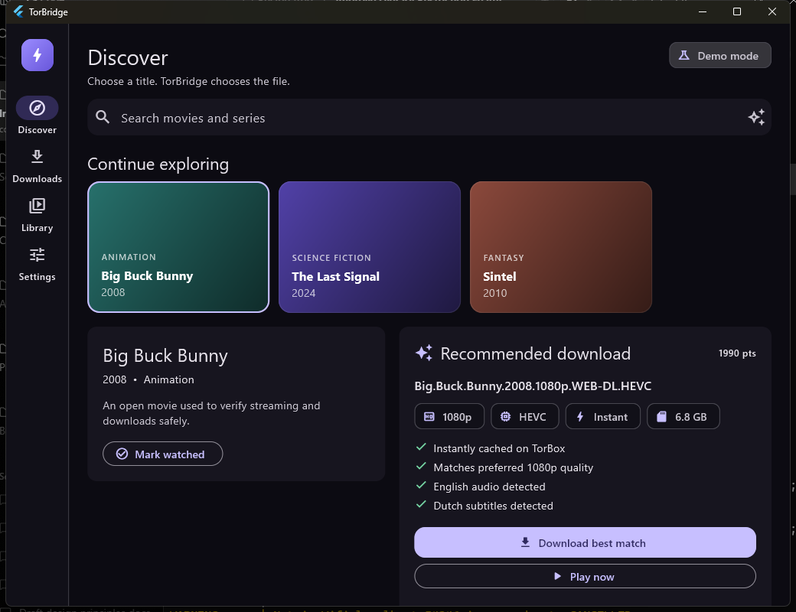
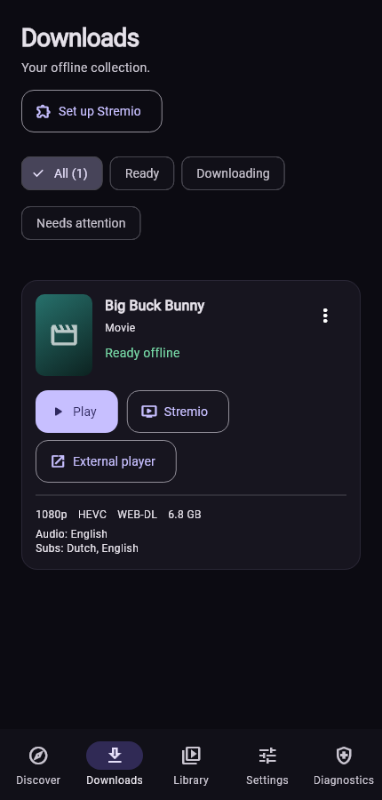

# TorBridge

**Find the right source. Keep it offline. Choose how to watch.**

A TorBox companion for Android and Windows, with AIOStreams discovery, local
video downloads, built-in playback, Stremio integration, and optional Trakt sync.

[](https://github.com/QuintonD/torbridge/releases/latest)
[](https://github.com/QuintonD/torbridge/releases)

[Download](#download) · [Update guide](docs/updating.md) · [Changelog](CHANGELOG.md) · [Report a bug](https://github.com/QuintonD/torbridge/issues/new?template=bug_report.yml)

## Download

| Your device | Current build | Download |
| --- | --- | --- |
| **Pixel 7a, Galaxy S25, and other ARM64 phones** | Android **1.2.12**, 42.4 MB | **[Download ARM64 APK](https://github.com/QuintonD/torbridge/releases/download/v1.2.12/TorBridge-Android-1.2.12-arm64.apk)** |
| Other supported Android architectures | Android **1.2.12**, 121.0 MB | [Download universal APK](https://github.com/QuintonD/torbridge/releases/download/v1.2.12/TorBridge-Android-1.2.12.apk) |
| Windows x64 | Windows **1.2.12**, 34.1 MB | [Download Windows ZIP](https://github.com/QuintonD/torbridge/releases/download/v1.2.12/TorBridge-Windows-x64-1.2.12.zip) |

[Release notes](https://github.com/QuintonD/torbridge/releases/tag/v1.2.12) · [SHA-256 checksums](https://github.com/QuintonD/torbridge/releases/download/v1.2.12/SHA256SUMS.txt) · [All releases](https://github.com/QuintonD/torbridge/releases)

### Updating an existing installation

**Android:** download the APK above and install it over TorBridge. **Do not
uninstall or clear app storage.** The APK is also the update file; both Android
variants use the same signing certificate. Open the app after updating and run
**Diagnostics → Run checks**. Updating does not re-download missing videos.

**Windows:** close TorBridge, extract the entire ZIP into a new folder, and run
`torbridge.exe`. Keep the included DLLs and `data` folder together.

See the [installation and update guide](docs/updating.md) for details. GitHub's
**Source code** archives are for development, not installation. Android builds
are signed for personal sideloading and are not distributed through Google Play.

### What's new in 1.2.12

Android now queues new transfers one at a time, checks free download storage,
and recovers HTTP 400 and restored interrupted transfers through a bounded
source-refresh/TorBox sequence. Storage errors stop further recovery attempts
and keep the failed record. Diagnostics shows available download storage.

Install over the existing app, run Diagnostics, then retry one failed video and
check playback before retrying a batch. If Android closes TorBridge, an active
system transfer can continue; **reopen the app to start the next queued item**.

Validation: 88 host tests, four native API 36 tests, verified signed updates and
release checksums. Physical Pixel 7a / Android 17 and live provider behavior
remain unverified. See the [investigation](docs/android-download-batches.md) and
[release notes](docs/releases/v1.2.12.md).

## A look inside

<p align="center">
  
  
</p>

*Desktop demo and mobile layout previews. More [interface screenshots](docs/ui-pass/README.md).*

## What TorBridge does

- Ranks sources against your quality, size, codec, audio, and subtitle preferences.
- Downloads exact movies and episodes, with recovery for supported source failures.
- Keeps completed Android videos in an offline library protected from Download
  Manager's original-file cleanup.
- Plays locally in TorBridge or hands a video to Stremio or another player.
- Supports optional Trakt sync and encrypted desktop-to-phone setup transfer.

Explore demo mode without credentials. Live discovery and downloads use your
AIOStreams configuration and TorBox account; Trakt is optional. Direct external
playback does not guarantee Trakt attribution. Only access media you are
licensed or otherwise authorized to download or watch.

## First run

1. Open **Settings → Connect services**.
2. Paste the configured AIOStreams manifest URL you already use with Stremio.
   TorBridge accepts `stremio://` and HTTPS manifest URLs and preserves the
   configuration path.
3. Paste your TorBox API token and choose **Check & save**. Both endpoints are
   validated before live mode is enabled.
4. Optional: create a personal Trakt API application, enter its client ID and
   secret, save, then choose **Authorize Trakt** and approve the one-time code.
5. Choose **Copy addon URL and open Stremio**, then confirm installation of
   **TorBridge Offline**. TorBridge opens the direct Stremio manifest link and
   also copies `http://127.0.0.1:11471/manifest.json` as a manual fallback.
6. Set preferred audio, subtitles, quality, size limit, HDR, whether the
   preferred audio is mandatory, and an optional watched-file cleanup delay.

Search for a movie or series, choose a season and episode, inspect the
explanation under **Recommended download**, and choose **Download best match**.
On Windows files go to `Downloads\TorBridge`. Android uses the system Download
Manager with app-specific Movies storage so the foreground Stremio bridge can
serve the file reliably without broad storage permission.

Only download or play media you are authorized to access.

## Transfer desktop setup to Android

1. Keep the Windows computer and Android device on the same local network.
2. In TorBridge Desktop, open **Settings → Transfer setup → Show setup QR**.
3. In TorBridge Mobile, open **Settings → Transfer setup → Scan desktop QR**.
4. Confirm that the six-digit codes match, review the services being imported,
   and choose **Import setup**.

On the first transfer, Windows Firewall may ask for network access. Allow
TorBridge on **Private networks** only; public-network access is unnecessary.

The QR contains a short-lived LAN address, one-time authorization token, and
random encryption key—not the TorBox, AIOStreams, or Trakt credentials. The
desktop sends an AES-256-GCM authenticated ciphertext, accepts one claim, and
ends the pairing session after five minutes. Preferences and credentials are
transferred; downloads, watched history, and local file paths stay on their
original device.

## What chooses the link

TorBridge parses Stremio stream metadata, verifies unknown torrent cache states
with one batched TorBox request, removes candidates that violate hard rules,
then scores the rest. The ranking considers:

- TorBox instant-cache status;
- preferred and allowed resolution;
- ordered audio and subtitle languages;
- HEVC, AV1, and H.264 codec preference;
- HDR preference;
- maximum file size;
- release quality, while rejecting CAM, telesync, and screener sources.

Every winner displays its positive reasons. Suitable alternatives remain
visible, but choosing one manually is not required.

## Playback, Stremio, and history

Completed files can be played in TorBridge, Stremio, or another installed player
from the download action menu. TorBridge's main player has audio-language and
embedded-subtitle selection, automatic/off choices, auto-hiding title controls,
and fullscreen playback. Android also offers **Use compatibility player** if
the main renderer fails; that fallback has limited track controls.

**Play in Stremio** sends a complete local stream directly to Stremio's player,
avoiding the online detail-page lookup. The loopback addon remains available at
`http://127.0.0.1:11471/manifest.json`. TorBridge must remain running while it
serves the file. A Stremio client may still require connectivity to initialize
its own UI; use TorBridge or an installed external player if that happens.

Direct Stremio playback may not associate the file with library history or
Trakt automatically. TorBridge only sends playback scrobbles for its embedded
player. External playback does not automatically mark the download watched.
Trakt watched-history import and configured cleanup remain available.

See the [playback audit](docs/playback-audit.md) for findings and verification
limits, including Android rendering and offline Stremio device testing.

Preferences, local watched IDs, queued Android jobs, and download records
survive restarts. Android reattaches to its system Download Manager job after a
cold start. Windows reports an interrupted in-process download as retryable.
Secrets are held in platform secure storage. Short-lived TorBox CDN links are
requested only when a download starts and are not saved in app state.

When an addon playback URL fails with a recoverable transfer error, TorBridge first
refreshes it and tries a suitable alternative. It then falls back automatically
to a fresh TorBox CDN link. When the source includes an info-hash, TorBridge
adds or finds that torrent and selects its referenced file. For URL-only
sources, it searches the connected TorBox account using title and episode names.
This recovery path also applies to season batch downloads. It does not perform
an independent TorBox IMDb search to acquire missing URL-only torrents.
Episode-file matching has known edge cases with stale indices and numeric
prefixes; see [audit A01](docs/application-audit-2026-09-10.md#a01--episode-identity-must-be-verified-against-the-file).

Download cards preserve quality, codec, HDR/release, audio, subtitle, size, and
source metadata. Use **Find another version** to pick a suitable alternative or
**Change download rules** before replacing a 1080p file with a 4K file. The
Diagnostics tab checks the local addon, file paths, canonical episode IDs, and
service configuration without displaying credentials.

## Build and test

Flutter 3.47.2 and Dart 3.13.2 were used for the supplied builds.

```powershell
.\tool\test.ps1
.\tool\build_android.ps1
.\tool\build_windows.ps1
```

To run the Android end-to-end journey on a booted emulator or phone:

```powershell
.\tool\test.ps1 -AndroidDevice emulator-5554
```

The helper prepares directory junctions for Flutter's Windows plugins. This is
needed on Windows hosts where Developer Mode (and therefore ordinary symlink
creation) is disabled; it does not change that security setting.

More detail is in [architecture](docs/architecture.md), [security](docs/security.md),
[test report](docs/test-report.md), [Windows computer-use replay](docs/computer-use-replay.md),
and [product plan](docs/product-plan.md).

## Known boundaries

- The local addon serves Stremio on the same Windows or Android device as
  TorBridge. Serving a Windows download to a Shield over the LAN is not part of
  this release.
- Direct Stremio playback avoids online title lookup but may not associate the
  stream with canonical movie/episode history. Client startup can still depend
  on connectivity; use the embedded or external player when necessary.
- Artwork is fetched from Cinemeta and uses an offline-safe gradient fallback
  when an image is unavailable.
- AIOStreams descriptions vary by provider. Unknown fields receive conservative
  scores instead of being guessed; cache state is verified directly when an
  info hash is available.
- A personal Trakt client ID and secret are required because this repository
  does not ship shared application credentials.
